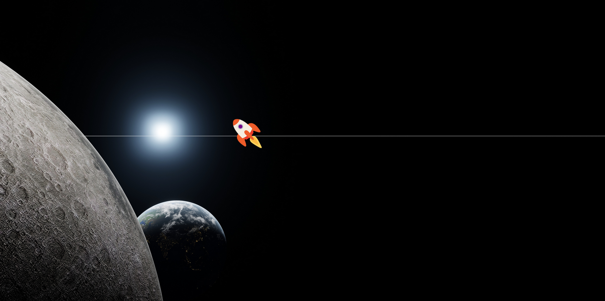

# 🌌🚀 RocketApp 🌌  
**The celestial journey where a rocket chases your cursor across a cosmic backdrop!**  

  

---

## 🌠 Features  
- **Cursor-Tracking Rocket**  
  A rocket 🚀 zooms across the screen in real-time as you move your cursor!  
- **Infinite Universe Background**  
  A mesmerizing fixed background that stays centered and scaled to your screen.  
- **Smooth Motion Physics**  
  CSS transitions make the rocket's movement buttery-smooth.  
- **Responsive Design**  
  Works flawlessly on any device, from phones to 8K screens.  

---

## 🛠️ Tech Stack  
| Category       | Tools Used                     |
|----------------|---------------------------------|
| **Markup**     | HTML5                           |
| **Styling**    | CSS3 (background/transition)  |
| **Interaction**| Vanilla JavaScript             |

---

## 🚀 How to Launch  
1. **Clone the repo**:  
   ```bash  
   git clone https://github.com/therealsaitama/RocketApp.git  
   ```  
2. **Launch your spaceship**:  
   Open `index.html` in any browser.  
3. **Watch the magic**:  
   Move your cursor to see the rocket in action!  

---

## 🧠 How It Works  
### 🔥 The Secret Sauce  
#### **JavaScript Magic**  
```javascript  
// Track cursor coordinates  
document.addEventListener("mousemove", (e) => {  
  move(e);  
});  

// Rocket movement calculation  
const move = (e) => {  
  myDiv.style.left = e.pageX - 50 + "px";  // Center rocket horizontally  
  myDiv.style.top = e.pageY - 50 + "px";   // Center rocket vertically  
};  
```  
*We offset by 50px (half the rocket's 100px size) to keep it centered on the cursor*

#### **CSS Propulsion**  
```css  
#my-div {  
  transition: 0.2s ease-out; /* Smooth motion blur effect */  
  position: absolute;  
}  
```  

---

## 🎨 Customization Guide  
| Setting               | Adjustment Method                          |
|-----------------------|---------------------------------------------|
| Rocket Size           | Modify `#my-div` dimensions in CSS         |
| Movement Smoothness   | Adjust `transition` duration in CSS        |
| Background Image      | Replace `bg-img.png` in the project folder |
| Rocket Image           | Swap `rocket.png` with your own image      |

---

## 🌍 Deployment  
Deploy your rocket adventure to the web in 3 steps:  
1. Host `index.html`, `style.css`, `script.js`, `rocket.png`, and `bg-img.png` together  
2. Share the link with astronauts everywhere  
3. Watch the stargazers count blast off! 🌌  

---

## 🛠️ Contribution Protocol  
1. **Fork this cosmic repository**  
2. Create your own stellar branch:  
   ```bash  
   git checkout -b feature/laser-engines  
   ```  
3. Push your intergalactic improvements  
4. Open a pull request to merge with the mothership  

---

## 📝 License  
Licensed under the [MIT License](LICENSE.md). Contribute boldly - the universe is yours!  

---

## 📢 Credits  
- Rocket graphic by [your-name-here] (replace with your name/credits)  
- Background starfield from [source-if-applicable]  

---

## 🌠 Future Missions (Stretch Goals)  
- [ ] Add gravitational pull effect  
- [ ] Implement parallax background  
- [ ] Add sound effects (rocket whoosh!)  
- [ ] Multi-rocket mode (swarm behavior)  

---

## 🪐 Support  
Having issues? Create a [GitHub Issue](https://github.com/therealsaitama/RocketApp/issues) or ping the captain:  
[](https://github.com/therealsaitama)  

---

## 🌌 Special Thanks  
To the pioneers of frontend development who made this cosmic journey possible.  

--- 

**Launch your own intergalactic project today!** 🌌✨  
**"The sky is not the limit - we're beyond that now."** - Captain Saitama  

---

### 📸 Screenshot Preview  
  
*Replace "screenshot.png" with your actual preview image file*  

---

### 💡 Inspiration  
Inspired by retro games and the infinite possibilities of CSS/JS animations.  

---